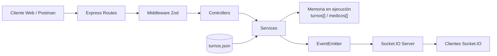
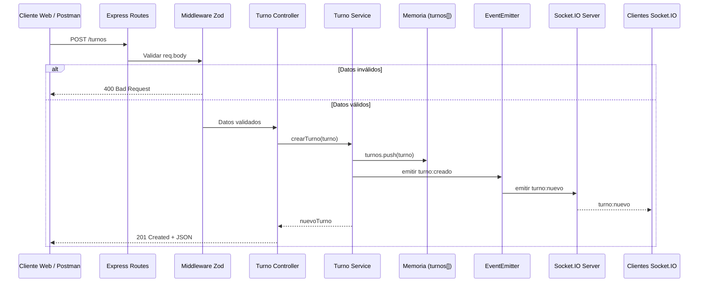

# turnos-red

API REST para la gestión de turnos médicos y médicos, desarrollada con Node.js, TypeScript y Express. El proyecto utiliza Zod para la validación de datos, variables de entorno mediante dotenv y Socket.IO para comunicación en tiempo real.

La aplicación recibe registros de turnos desde un archivo JSON, normaliza y valida los datos, descarta registros inválidos y permite realizar operaciones CRUD mediante una API RESTful.

## Requisitos previos

* Node.js LTS
* NVM (Node Version Manager)
* npm

La versión de Node.js utilizada por el proyecto está definida en el archivo `.nvmrc`.

## Instalación

Instalar o seleccionar la versión de Node.js indicada por el proyecto:

```bash
nvm use
```

Instalar las dependencias:

```bash
npm install
```

Crear el archivo `.env` utilizando `.env.example` como referencia.

Ejemplo:

```env
PORT=3000
DATA_FILE=./data/turnos.json
```

## Variables de entorno

| Variable    | Descripción                                   | Ejemplo              |
| ----------- | --------------------------------------------- | -------------------- |
| `PORT`      | Puerto utilizado por el servidor              | `3000`               |
| `DATA_FILE` | Ruta del archivo JSON que contiene los turnos | `./data/turnos.json` |

El archivo `.env` contiene configuración local y no debe incluirse en el repositorio.

## Scripts y comandos disponibles

### Ejecutar ESLint

```bash
npm run lint
```

Analiza el código TypeScript y detecta problemas de estilo y posibles errores.

### Aplicar formato con Prettier

```bash
npm run format
```

Aplica el formato definido para el proyecto.

### Verificar TypeScript

```bash
npx tsc --noEmit
```

Comprueba que el código TypeScript compile correctamente sin generar archivos de salida.

### Ejecutar el servidor

```bash
npx tsx src/index.ts
```

Inicia el servidor Express y Socket.IO.

## Procesamiento y normalización de datos

Los registros de turnos se obtienen desde el archivo definido mediante `DATA_FILE`.

La lectura se realiza de forma asíncrona utilizando `node:fs/promises`, `async` y `await`.

Cada registro es procesado mediante la función `normalizarTurno`, que realiza conversiones y validaciones como:

* Conversión del `id` de texto a número.
* Conversión del `documento` a `string`.
* Eliminación de espacios innecesarios.
* Normalización de especialidades.
* Conversión de fecha al formato `YYYY-MM-DD`.
* Normalización de hora.
* Conversión de `confirmado` a booleano.
* Validación de fechas reales.
* Validación de horas.
* Validación de IDs enteros positivos.
* Validación de `medicoId`.

Los registros válidos son cargados en memoria y los registros que no cumplen las validaciones son rechazados.

Al iniciar el servidor se informa por consola la cantidad de registros aceptados y rechazados.

## Arquitectura RESTful

La API utiliza los verbos HTTP correspondientes a cada operación:

| Operación           | Verbo HTTP |
| ------------------- | ---------- |
| Obtener recursos    | `GET`      |
| Crear recursos      | `POST`     |
| Actualizar recursos | `PUT`      |
| Eliminar recursos   | `DELETE`   |

Los códigos HTTP utilizados incluyen:

* `200 OK` — operación exitosa.
* `201 Created` — recurso creado correctamente.
* `204 No Content` — recurso eliminado correctamente.
* `400 Bad Request` — datos inválidos o parámetros incorrectos.
* `404 Not Found` — recurso no encontrado.
* `500 Internal Server Error` — error interno del servidor.

## Manejo estandarizado de errores

Los errores son gestionados mediante un middleware centralizado.

Las respuestas de error utilizan una estructura JSON uniforme:

```json
{
  "status": 400,
  "message": "Error de validación en los datos ingresados",
  "code": "VALIDATION_ERROR",
  "details": []
}
```

Los errores de validación generados por Zod son transformados al formato estándar y `details` contiene información sobre los campos que no cumplen el esquema.

Los errores de recursos inexistentes utilizan el código `NOT_FOUND`.

## Validación con Zod

La API utiliza Zod para validar los datos recibidos en las operaciones de creación y actualización.

Las especialidades permitidas son:

* `Clínica médica`
* `Pediatría`
* `Odontología`
* `Nutrición`

El campo `documento` se maneja como `string`.

Los errores de validación generan una respuesta `400 Bad Request` con información específica del campo que produjo el error.

## API REST — Turnos

### Obtener todos los turnos

```http
GET /turnos
```

Respuesta exitosa:

```text
200 OK
```

### Obtener un turno por ID

```http
GET /turnos/:id
```

Respuestas posibles:

```text
200 OK
400 Bad Request
404 Not Found
```

### Crear un turno

```http
POST /turnos
```

Respuesta exitosa:

```text
201 Created
```

### Actualizar un turno

```http
PUT /turnos/:id
```

Respuestas posibles:

```text
200 OK
400 Bad Request
404 Not Found
```

### Eliminar un turno

```http
DELETE /turnos/:id
```

Respuestas posibles:

```text
204 No Content
400 Bad Request
404 Not Found
```

## Filtros de turnos

Los filtros se realizan mediante parámetros de consulta sobre el endpoint existente `GET /turnos`.

### Filtrar por especialidad

```http
GET /turnos?especialidad=Pediatría
```

### Filtrar por fecha

La fecha utilizada en las consultas debe utilizar el formato `YYYY-MM-DD`.

```http
GET /turnos?fecha=2026-08-14
```

### Filtrar por médico

```http
GET /turnos?medicoId=1
```

También es posible combinar parámetros:

```http
GET /turnos?especialidad=Pediatría&fecha=2026-08-14&medicoId=1
```

Los parámetros inválidos generan una respuesta `400 Bad Request`.

## API REST — Médicos

### Obtener todos los médicos

```http
GET /medicos
```

Respuesta exitosa:

```text
200 OK
```

### Obtener un médico por ID

```http
GET /medicos/:id
```

Respuestas posibles:

```text
200 OK
400 Bad Request
404 Not Found
```

### Crear un médico

```http
POST /medicos
```

Respuesta exitosa:

```text
201 Created
```

### Actualizar un médico

```http
PUT /medicos/:id
```

Respuestas posibles:

```text
200 OK
400 Bad Request
404 Not Found
```

### Eliminar un médico

```http
DELETE /medicos/:id
```

Respuestas posibles:

```text
204 No Content
400 Bad Request
404 Not Found
```

## Filtros de médicos

Los filtros se realizan mediante parámetros de consulta sobre el endpoint existente `GET /medicos`.

### Filtrar por especialidad

```http
GET /medicos?especialidad=Pediatría
```

### Filtrar por disponibilidad

```http
GET /medicos?disponible=true
```

También se puede consultar médicos no disponibles:

```http
GET /medicos?disponible=false
```

Los parámetros inválidos generan una respuesta `400 Bad Request`.

## Ejemplo de error de validación

Si se intenta crear un médico con un nombre vacío:

```json
{
  "id": 10,
  "nombre": "",
  "especialidad": "Pediatría",
  "disponible": true
}
```

La API responde:

```text
400 Bad Request
```

Con una estructura similar a:

```json
{
  "status": 400,
  "message": "Error de validación en los datos ingresados",
  "code": "VALIDATION_ERROR",
  "details": [
    {
      "path": [
        "nombre"
      ],
      "message": "Too small: expected string to have >=1 characters"
    }
  ]
}
```

## Eventos internos

El proyecto utiliza el módulo nativo `EventEmitter` de Node.js como bus de eventos interno.

Las operaciones exitosas sobre turnos generan los siguientes eventos:

| Operación        | Evento interno      |
| ---------------- | ------------------- |
| Crear turno      | `turno:creado`      |
| Actualizar turno | `turno:actualizado` |
| Eliminar turno   | `turno:eliminado`   |

Estos eventos permiten mantener desacoplada la lógica del servicio de la comunicación en tiempo real.

## Comunicación en tiempo real

Socket.IO está integrado con el servidor HTTP utilizado por Express.

Los eventos internos son retransmitidos a los clientes conectados:

| Evento interno      | Evento Socket.IO    |
| ------------------- | ------------------- |
| `turno:creado`      | `turno:nuevo`       |
| `turno:actualizado` | `turno:actualizado` |
| `turno:eliminado`   | `turno:eliminado`   |

De esta forma, los clientes pueden recibir modificaciones de los turnos en tiempo real sin necesidad de realizar consultas periódicas mediante polling.

## Estructura del proyecto

```text
turnos-red/
│
├── data/
│   └── turnos.json
│
├── postman/
│   └── archivos de requests y ejemplos
│
├── src/
│   ├── controllers/
│   │   ├── medicoController.ts
│   │   └── turnoController.ts
│   │
│   ├── events/
│   │   └── eventBus.ts
│   │
│   ├── middleware/
│   │   ├── apiError.ts
│   │   └── errorHandler.ts
│   │
│   ├── models/
│   │   ├── medico.ts
│   │   └── turno.ts
│   │
│   ├── routes/
│   │   ├── medicoRoutes.ts
│   │   └── turnoRoutes.ts
│   │
│   ├── schemas/
│   │   ├── medicoSchema.ts
│   │   └── turnoSchema.ts
│   │
│   ├── services/
│   │   ├── medicoService.ts
│   │   └── turnoService.ts
│   │
│   ├── utils/
│   │   └── archivoService.ts
│   │
│   ├── index.ts
│   └── testSocket.ts
│
├── .env.example
├── .gitignore
├── .nvmrc
├── package.json
├── package-lock.json
├── tsconfig.json
└── README.md
```

## Responsabilidades de las carpetas

### `models/`

Contiene las interfaces que representan los datos utilizados por el sistema, como `Turno`, `TurnoCrudo` y los modelos relacionados con médicos.

### `schemas/`

Contiene los esquemas de Zod utilizados para validar los datos recibidos por la API.

### `services/`

Contiene la lógica de negocio y las operaciones CRUD de turnos y médicos, además de la normalización de los datos iniciales.

### `controllers/`

Procesa las peticiones HTTP, obtiene los parámetros necesarios y genera las respuestas correspondientes.

### `routes/`

Define los endpoints REST y los conecta con los controllers.

### `middleware/`

Contiene las clases y funciones relacionadas con el manejo centralizado de errores de la API.

### `events/`

Contiene el bus de eventos interno basado en `EventEmitter`.

### `utils/`

Contiene funciones auxiliares, como la lectura asíncrona del archivo JSON.

### `data/`

Contiene el archivo JSON utilizado como fuente inicial de datos.

### `index.ts`

Configura Express, el servidor HTTP, Socket.IO, las variables de entorno, las rutas, la carga inicial de turnos y el middleware de errores.

### `testSocket.ts`

Cliente utilizado durante el desarrollo para comprobar la recepción de eventos mediante Socket.IO.

## Postman

La API fue probada utilizando Postman.

La colección contempla:

* Happy Path.
* Bad Request.
* Not Found.
* Pruebas automatizadas de códigos HTTP.
* Validación de estructuras JSON.
* Variables de entorno.
* Variables dinámicas para IDs.
* Ejemplos de respuestas guardadas.
* Pruebas de parámetros de consulta.
* Mock Server mediante Postman Code Mock.

Las variables principales utilizadas en el entorno son:

| Variable   | Ejemplo                 |
| ---------- | ----------------------- |
| `baseUrl`  | `http://localhost:3000` |
| `turnoId`  | `102`                   |
| `medicoId` | `1`                     |

Las variables `turnoId` y `medicoId` se actualizan automáticamente después de crear los respectivos recursos.

## Uso de Inteligencia Artificial

Durante el desarrollo se utilizó Inteligencia Artificial como herramienta de apoyo técnico.

| Tarea                          | Herramienta | Prompt                                                                                | Respuesta generada                                                 | Ajuste manual aplicado                                                                 |
| ------------------------------ | ----------- | ------------------------------------------------------------------------------------- | ------------------------------------------------------------------ | -------------------------------------------------------------------------------------- |
| Revisión de arquitectura REST  | ChatGPT     | Solicitud de revisión de endpoints, verbos HTTP y códigos de respuesta                | Sugerencias para mejorar la arquitectura RESTful                   | Se revisaron y adaptaron los endpoints al código existente                             |
| Manejo centralizado de errores | ChatGPT     | Solicitud de una estructura uniforme para errores de la API                           | Propuesta de `ApiError` y middleware centralizado                  | Se adaptaron los mensajes y códigos a los requisitos de la actividad                   |
| Validación con Zod             | ChatGPT     | Solicitud de esquemas Zod para turnos y médicos                                       | Propuesta de schemas y validaciones                                | Se ajustaron especialidades y campos a los requisitos del proyecto                     |
| Filtros mediante query params  | ChatGPT     | Solicitud de filtros para `GET /turnos` y `GET /medicos`                              | Propuesta de implementación mediante parámetros de consulta        | Se implementaron y probaron los filtros en el proyecto                                 |
| Pruebas automatizadas Postman  | ChatGPT     | Solicitud de tests para códigos HTTP y estructura JSON                                | Propuestas de scripts de prueba                                    | Se adaptaron los tests a las respuestas reales de la API                               |
| Documentación JSDoc/OpenAPI    | ChatGPT     | Solicitud de documentación de rutas y endpoints mediante Swagger/OpenAPI              | Propuestas de anotaciones JSDoc, parámetros, respuestas y schemas  | Se ajustaron las anotaciones a las rutas, validaciones y respuestas reales del backend |
| Diagramas Mermaid              | ChatGPT     | Solicitud de diagramas de arquitectura y secuencia para documentar el flujo de la API | Propuestas de diagramas de componentes y secuencia                 | Se adaptaron los diagramas a la arquitectura y al flujo real del proyecto              |
| ADR                            | ChatGPT     | Solicitud de estructura y contenido para ADR sobre OpenAPI y adopción futura de JWT   | Propuestas de estructura, decisiones, consecuencias y alternativas | Se revisaron las propuestas y se adaptaron a las decisiones y alcance de la actividad  |
| Documentación README           | ChatGPT     | Solicitud de actualización y organización del README                                  | Propuesta de estructura y documentación                            | Se revisó y adaptó la documentación a la implementación final                          |

La Inteligencia Artificial fue utilizada como apoyo para analizar, explicar y proponer soluciones. La implementación final fue revisada y ajustada manualmente.

## Arquitectura general

El siguiente diagrama representa los principales componentes de la aplicación y la comunicación entre ellos.



## Secuencia — POST /turnos

El siguiente diagrama representa el flujo de creación de un turno desde la petición HTTP hasta la respuesta al cliente y la notificación en tiempo real. Los datos iniciales se cargan desde `turnos.json` al iniciar el servidor; las operaciones CRUD posteriores se gestionan en memoria.



## Tecnologías utilizadas

* Node.js LTS
* TypeScript
* Express
* Zod
* Socket.IO
* dotenv
* ESLint
* Prettier
* npm
* Postman
* Git
* GitHub

